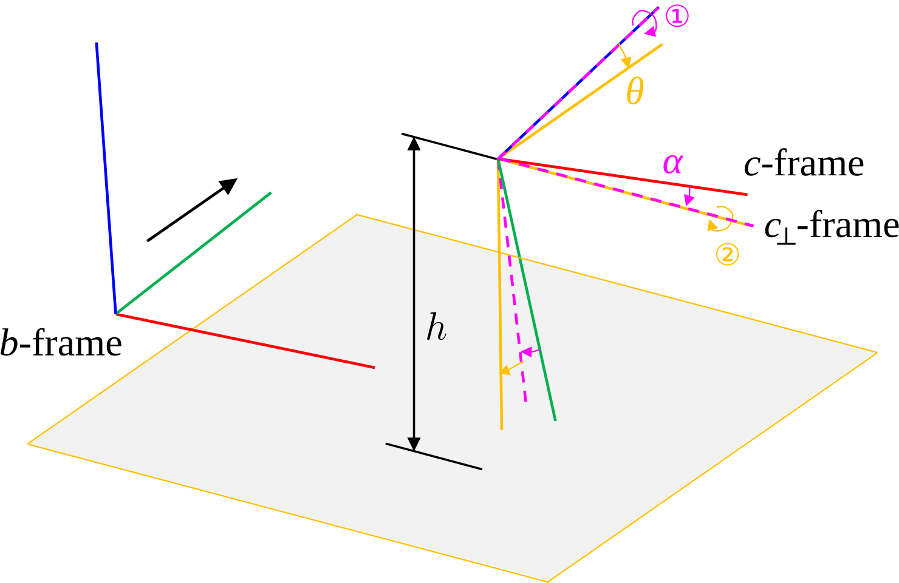

# RoadLib
>A lightweight library for instance-level visual road marking extraction, parameterization, mapping, map-aided localization, etc.

## What is this? 

This is a enhanced version of our work "Visual Mapping and Localization System Based on Compact Instance-Level Road Markings With Spatial Uncertainty" ([RA-L 2022](https://ieeexplore.ieee.org/document/9850364)).

<br>
<div align=center>

</div>
<br>

I have made practical modifications to the original version and hope this can serve as a reference for related research. A video preview is available [here](https://www.bilibili.com/video/BV1bp42117N1) .


## What is new? (compared to the original paper)

* Batch pipeline ➡️ Incremental pipeline

* Ellipsoid parameterization (SVD-based) ➡️ Bounding box parameterization

* High-precision poses always required ➡️ Local mapping + geo-registering

* And so on...

## Update log
- [x] Code Upload (**deadline**: 2024/06)
- [x] Mapping Example (**deadline**: 2024/06)
- [x] Localization Example (**deadline**: 2024/06)
- [ ] More Examples 

## Installation


* The project depends on OpenCV, PCL, GLFW3 and Ceres (for localization). Install these libraries first.

* Use the following commands to compile the project.

```Bash
git clone https://github.com/GREAT-WHU/RoadLib.git
cd RoadLib
mkdir build
cd build
cmake ..
make -j8
```

* This project has been tested on **Windows 10** and **Ubuntu 20.04 (WSL2)**. If you have any trouble building the project, please raise an issue.

* For ceres version < 2.1.0, you might need to replace the "ceres::Manifold" in the code to "ceres::LocalParameterization" manually.

## Inference model (road marking segmentation)

We provide an pretrained pytorch [model](https://whueducn-my.sharepoint.com/:f:/g/personal/2015301610143_whu_edu_cn/EjnKWS_nn5dFtfaKRkCwpTUBrgHChZW7jAMK3yzIXQ1H8Q?e=Dy4uyf) for road marking segmentation. The model is based on the Segformer implementation of [MMSegmentation](https://github.com/open-mmlab/mmsegmentation). We use the apolloscape dataset and our self-made dataset (around 500 images) collected in Wuhan City to train the model, which works fine in the road environments of Wuhan. 

To test the model, MMSegmentation is needed. After the installation, put [segformer_whu.py](scripts/segformer_whu.py) to the "configs/segformer" folder of the MMSegmentation project.

See
```Bash
python scripts/inference_example.py
```
for details of the inference.

Notice that this is just a toy model due to the limited training set. You may train your own road marking segmentation model to fit your applications.

## Run the example

### 1. Mapping example

Download the test dataset we collected in Wuhan City [here](https://whueducn-my.sharepoint.com/:u:/g/personal/2015301610143_whu_edu_cn/EVow179FE29GhRfXTnR3NEIBS2dutK0VAmMPvsNdEsc5LA?e=XFq9a9).

To run the mapping example, follow the command below

```Bash
./build/demo_mapping ./config/WHU_0412/vi.yaml ${DATASET}/stamp.txt ${DATASET}/cam0 ${DATASET}/semantic ${DATASET}/gt.txt ${DATASET}/odo.txt ./map_output.bin
```

This demo would perform incremental mapping and geo-registering sequentially. The main function (demo_mapping.cpp) is written in a simple script-like manner, feel free to modify it.

The generated file would be saved to a binary file. Use "scripts/view_map.py" for visualization.


### 2. Map-aided localization example

We provide a simple example for map-aided localization based on the pre-built map. Notice that the functionality of **coarse matching** (or  **re-localization**) is currently not provided. A meter-level **initial guess** of the vehicle pose is needed for the initial map matching, after which global pose measurements are not necessary.

In this example, we use the same data sequence of the mapping phase for map-aided localization, as a simple functionality test. To run the localization example, follow the command below

```Bash
./build/demo_localization ./config/WHU_0412/vi_loc.yaml ${DATASET}/stamp.txt ${DATASET}/cam0 ${DATASET}/semantic ${DATASET}/gt.txt ${DATASET}/odo.txt ./map_output.bin ./localization_result.txt
```

Notice that the map file "map_output.bin" needs to be pre-built (see the **mapping example**). The ground-truth file is needed to provide the **initial guess** (prior pose estimation of the first epoch). 

The generated localization result would be saved to a text file. Use "scripts/evaluate_localization.py" to evaluate the accuracy.

## Run on your own dataset

To run on your own dataset, the following data/metadata need to be prepared.

* Monocular RGB images with calibrated intrinsics.
* Semantic masks of the images with road marking segmentation. See [inference model](#inference-model-road-marking-segmentation) for details.
* Camera-ground geometric parameters for IPM. Here we use the conventions consistent with [gv_tools](https://github.com/GREAT-WHU/gv_tools) ($h$ for height, $\theta$ for pitch, $\alpha$ for roll).

<br/>
<div align=center>

</div>
<br/>

* Odometry poses for local mapping. 
* Global poses for geo-registering. The global poses could be obtained by fusing GNSS and odometry (VIO for example). See the global estimator in VINS-Fusion for reference.

In all the tests, we assume the body frame to be **right-forward-up** and the camera frame to be **right-down-forward**. Modifications might be needed if you are using a different setup.

## About the viewer perfomrance
The handcrafted legacy OpenGL viewer works fine on my Windows, but the performance is very poor on my WSL2. If you have any ideas or solutions, please contact me. 

## Limitations
The obvious limitation of the project is that it only focuses on the road markings. We hope to support other roadside object instances (like poles, signs) in the future.

The code project still has a lot of room for improvement. Feel free to discuss it with me!

## Acknowledgement
RoadLib is developed by [GREAT](http://igmas.users.sgg.whu.edu.cn/group) (GNSS+ REsearch, Application and Teaching) Group, School of Geodesy and Geomatics, Wuhan University. 

<br/>
<div align=center>

</div>
<br/>
<div align=center>

</div>
<br/>

We use the [camodocal](https://github.com/hengli/camodocal) project to handle camera models, while we modify it to a minimal version which doesn't need Ceres.

The codebase and documentation is licensed under the [GNU General Public License v3 (GPL-3)](https://www.gnu.org/licenses/gpl-3.0.txt).
