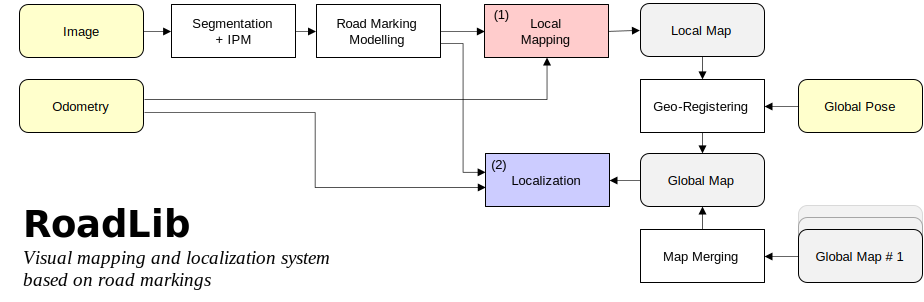

# RoadLib
A lightweight library for instance-level visual road marking extraction, parameterization, mapping, map-aided localization, etc.

## What is this? 

This is a enhanced version of our work "Visual Mapping and Localization System Based on Compact Instance-Level Road Markings With Spatial Uncertainty" (RA-L 2022).

<div align=center>

</div>

## What is new? (compared to the original paper)

* Batch pipeline ➡️ Incremental pipeline

* Ellipsoid parameterization (SVD-based) ➡️ Bounding box parameterization

* High-precision poses always required ➡️ Local mapping + geo-registering

* And so on...

## Update log
- [ ] Code Upload (**deadline**: 2024/06)
- [ ] Mapping Example
- [ ] Localization Example

## Installation


* The project depends on OpenCV, PCL and GLFW3. Install these libraries first.

* Use the following commands to compile the project.

```Bash
mkdir build
cd build
cmake ..
make -j8
```

## Inference model (road marking segmentation)

We provide an example ONNX model for road marking segmentation. The model is based on the Segformer implementation of MMSegmentation. We use the apolloscape dataset and our self-made dataset (around 500 images) collected in Wuhan City to train the model, which works fine in the road environments of Wuhan. 

See
```Bash
python scripts/inference_example.py
```
for details of inference.

You may train your own road marking segmentation model to fit your applications.

## Run the example

TODO

## Run on your own dataset

TODO

## Limitations
The obvious limitation of the project is that it only focuses on the road markings. We hope to support other road instances (like poles, signs) in the future.